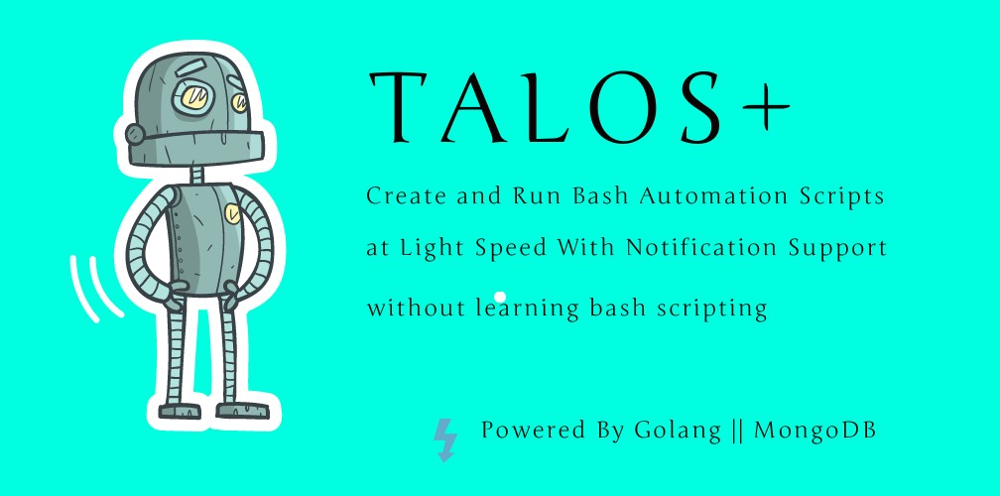
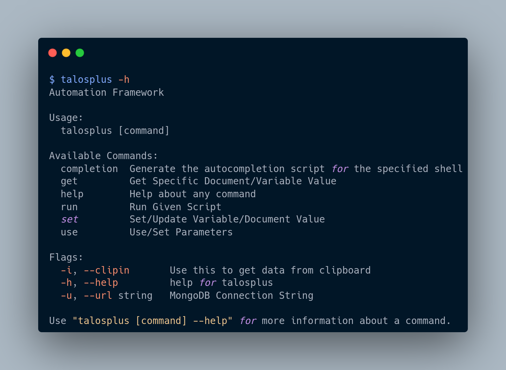

<p align="center" >

</br>
</p>


<p align="center">
<a href="https://opensource.org/licenses/BSD-3-Clause"></a>
<a href="https://goreportcard.com/badge/github.com/tarunKoyalwar/talosplus"></a>
<a href="https://github.com/tarunKoyalwar/talosplus/releases"></a>
<a href="https://twitter.com/KoyalwarTarun"></a>
</p>

<p align="center">
 <a href="#screenshots">Screenshots</a> •
 <a href="#blogs">Blogs</a> •
  <a href="#features">Features</a> •
  <a href="#installation-instructions">Installation</a> •
  <a href="#usage">Usage</a> 
</p>


Talosplus is tool to run bash scripts at faster rate by executing commands in parallel using goroutines and with some exceptional features like **Auto Scheduling, Filesystem Abstraction ,Stop/Resume, Buffers,Thread Safe ,Fail Safe, Serial + Parallel Execution, Notification Support** etc provided that script follows given Syntax and is integrated with **MongoDB** which provides lot of flexiblity similar to `bbrf` especially for Bug Hunters, Security Professionals etc.

# Blogs / How To Guides

[Create Your Ultimate Bug Bounty Automation Without Nerdy Bash Skills](https://medium.com/@zealousme/create-your-ultimate-bug-bounty-automation-without-nerdy-bash-skills-part-1-a78c2b109731)

- [Part 1](https://medium.com/@zealousme/create-your-ultimate-bug-bounty-automation-without-nerdy-bash-skills-part-1-a78c2b109731)

- [Part 2](https://medium.com/@zealousme/create-your-ultimate-bug-bounty-automation-without-nerdy-bash-skills-part-2-c8cd72018922)

- [Part 3](https://medium.com/@zealousme/create-your-ultimate-bug-bounty-automation-without-nerdy-bash-skills-part-3-7ee2b353a781)

# Why ??

Why use this when bash scripts can be run directly ?? You can think of this like a middleware to run bash scripts . I wanted to create a perfect automation much like **@hakluke** . This project resolves all challenges and issues I faced while writing bash scripts and creating the perfect automation and makes it possible to leverage all important features with comments `Ex: #as:@nmapout, #from:@allsubs etc` . and adds a lot of additional features.

Even If you are a little intriqued, Consider reading [my blog](https://medium.com/@zealousme/create-your-ultimate-bug-bounty-automation-without-nerdy-bash-skills-part-1-a78c2b109731) . Which describes how I overcame challenges I faced , how and when to use these comments ? and effective use of this project and detailed description of all its features like scheduling algo etc.


~~~
If you don't want to use of these comments  or features . Supplying your regular bash script
Will run every command it can find in parallel.
~~~

# Screenshots


- Sample Bash Script with Syntax at [here](static/script.png)

- Talosplus output at [here](static/cmdout.png)

- Custom Discord Notification at [here](static/notification.png)


# Features

These are oversimplified features to name from my blog.

- Auto Scheduling Commands at Runtime
- Intelligent Automation
- Filesystem Abstraction
- Discord Notification Support
- Thread Safe
- All Features of BBRF+ Others (MongoDB Backend)
- Easy Syntax
- Fail Safe && Condition Checks
- Stop /Resume(BETA) 
- No Compatiblity issues

# Installation Instructions

- Install MongoDB.

- Download Binary From [Releases](https://github.com/tarunKoyalwar/talosplus/releases) .

- Build From Source .

~~~sh
go install github.com/tarunKoyalwar/talosplus/cmd/talosplus@latest
~~~


Refer to Blog [Part 3](https://medium.com/@zealousme/create-your-ultimate-bug-bounty-automation-without-nerdy-bash-skills-part-3-7ee2b353a781) for step by step instructions in detail.

# Usage

```sh
talosplus -h
```

This will display help for the tool

<p align="center" >

</br>
</p>


Talosplus has every feature that would make it easy to write and run bash scripts . 

## Writing Automation Scripts With Syntax
To leverage all features of Talosplus like Auto Scheduling etc . It is essential the written bash script follows the syntax . Example of such bash script can be found at [subenum.sh](examples/subenum.sh) . 

In detail guide of how to write such scripts and using the syntax can be found at [blog](https://medium.com/@zealousme/create-your-ultimate-bug-bounty-automation-without-nerdy-bash-skills-part-2-c8cd72018922)

## Usage in Detail

In depth details on running any scripts ,configs , interacting with db , storing and retrieving any subdomain(or any variable from bash script) etc. and much more can be found at [blog](https://medium.com/@zealousme/create-your-ultimate-bug-bounty-automation-without-nerdy-bash-skills-part-3-7ee2b353a781)

# Support

If you like `talosplus` and want to see it improve furthur or want me to create intresting projects , You can buy me a coffee 

[](https://ko-fi.com/B0B4CPU5V)

# Acknowledgment

Some Features are inspired by [@honoki/bbrf-client](https://github.com/honoki/bbrf-client)