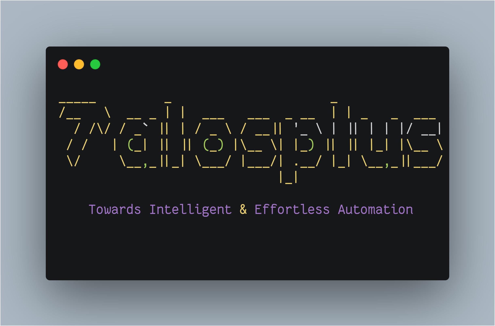
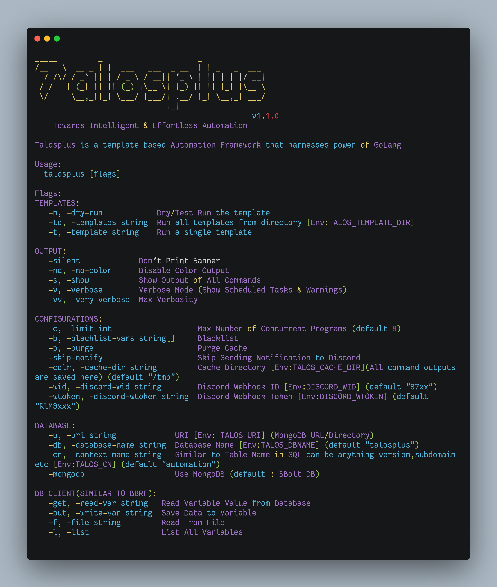

<p align="center" >

</br>
</p>


<p align="center">
<a href="https://opensource.org/licenses/BSD-3-Clause"></a>
<a href="https://goreportcard.com/badge/github.com/tarunKoyalwar/talosplus"></a>
<a href="https://github.com/tarunKoyalwar/talosplus/releases"></a>
<a href="https://twitter.com/KoyalwarTarun"></a>
</p>

<p align="center">
 <a href="#screenshots">Screenshots</a> •
 <a href="#blogs">Blog</a> •
  <a href="#features">Features</a> •
  <a href="#installation-instructions">Installation</a> •
  <a href="#usage">Usage</a> 
</p>

# What is Talosplus?

Talosplus is a fast and robust **template based Intelligent automation framework** that is designed to create and run automation scripts with almost no knowledge of bash scripting. However having knowledge of bash scripting allows one to create complex automation that is usually not possible with **bash alone**.

Bash was written in 80's in c so it lacks many features that are required to create and run **modern Intelligent automation scripts** . Instead of creating automation in different scripting languages (python etc) or other DSLs. talosplus allows to create intelligent automation scripts by adding annotations (variables & modules) to existing bash scripts.

## How does it work?? 

The concept is similar to how **goroutines** work in Golang , goroutines are managed by go runtime unlike threads . In this case all heavy lifting is done by talosplus at runtime and it manages all issues related with concurrency , data sharing etc and only simplified commands are executed at low level using goroutines.


# Features

These are some oversimplified features that are provided by talosplus.

- Parallel Execution of Commands using goroutines
- Auto Scheduling & Data sharing b/w Commands at Runtime
- Filesystem Abstraction
- Caching 
- Discord Notification Support
- Thread Safe
- Persistent storage using MongoDB,BBoltDB(Similar to sqlite)
- Easy & Lenient Syntax
- Fail Safe && Condition Checks
- Stop /Resume (BETA) 
- No Compatiblity issues with bash
- Other Features Similar to `bbrf-client`,`interlace`,`rush` etc


When bash script is written using **proper annotations** it barely looks like a bash script for example [sub_enum.sh](static/script.png) which is used for **subdomain enumeration** . It looks like list of commands with some annotions and comments but it is probably the **fastest and simplest automation script** available out there.

## Flow of Execution


When above **template/script is executed using talosplus** . It parses and validates syntax (i.e annotations) and creates **graph** like datastructure using these annotations and creates a execution pyramid . This execution pyramid contains details like which commands can be run in parllel and details of commands that dependents on this command and lot of other stuff and provides best possible execution flow and handles all edge cases in cases of failures , missing output etc.

# Screenshots


-  [Subdomain Enum Template](static/script.png)

-  [Talosplus output](static/cmdout.png)

-  [Custom Discord Notification](static/notification.png)

-  [Demo Output Video(Old)](https://asciinema.org/a/qHeRefcO6WOPrWuNAnpcuICLf.svg)

# Installation Instructions

- Download Binary from Releases

- Build From Source .

~~~sh
go install github.com/tarunKoyalwar/talosplus/cmd/talosplus@latest
~~~


Do Star the repo to show  your support.
Follow me on [github](https://github.com/tarunKoyalwar) / [twitter](https://twitter.com/KoyalwarTarun) to get latest updates on Talosplus.


# Usage

```bash
talosplus -h
```

Above Command will display help for the tool. Here are all options supported by talosplus




# Resources

[Create Your Ultimate Bug Bounty Automation Without Nerdy Bash Skills](https://medium.com/@zealousme/create-your-ultimate-bug-bounty-automation-without-nerdy-bash-skills-part-1-a78c2b109731)

- [Part 1](https://medium.com/@zealousme/create-your-ultimate-bug-bounty-automation-without-nerdy-bash-skills-part-1-a78c2b109731)

- [Part 2](https://medium.com/@zealousme/create-your-ultimate-bug-bounty-automation-without-nerdy-bash-skills-part-2-c8cd72018922)

- [Part 3 (Outdated)](https://medium.com/@zealousme/create-your-ultimate-bug-bounty-automation-without-nerdy-bash-skills-part-3-7ee2b353a781)


# Syntax / Annotations

There are only 3 different types of annotations

1. Variables (Starts with @)
2. Modules/directives  (starts with #)
3. Comments (starts with // and are above a command)

Talosplus uses comments to represent a command and this comment is linked/embedded with command at runtime these comments are printed instead of commands for simplicity.

Details about using these annotations can be found [here](./SYNTAX.md)


# Disclaimer

1. Taloplus is just a parser tool and is not aware of bash syntax at least not in this major release

2. Each Command is sandboxed if you are using bash  variables etc it won't work .It has to be variables

3. Loops & Conditional statements  Will Work But they can only be in a single line or newline should be escaped using `\`. or must be enclosed within `#block{}` module to write it without any restrictions


# Support

If you like `talosplus` and want to see it improve furthur or want me to create intresting projects , You can buy me a coffee 

[](https://ko-fi.com/B0B4CPU5V)

# Acknowledgment

Some Features are inspired by [@honoki/bbrf-client](https://github.com/honoki/bbrf-client)